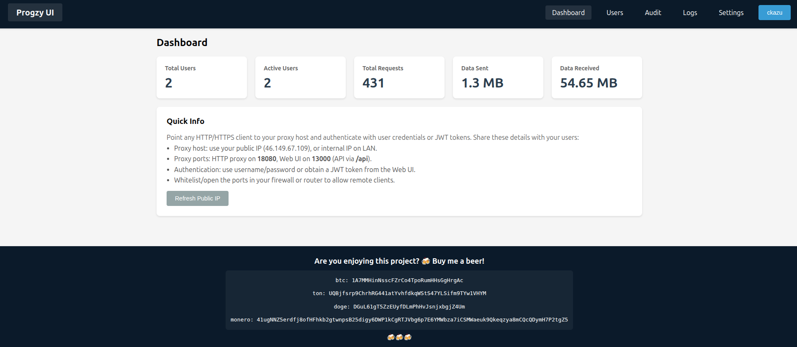
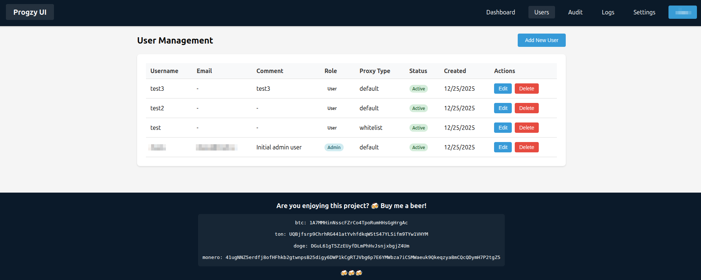

# Progzy Proxy Server

Production-ready HTTP/HTTPS proxy with an admin UI, PostgreSQL storage, and Docker-first deployment.




## Quick start (one command)

```bash
docker compose up -d
```

Open the UI:

```
http://localhost:13000
```

First visit redirects to the initial admin setup page.

## How it works

- Proxy listens on `18080` and accepts Basic Auth or JWT Bearer tokens.
- Admin UI runs on `13000` and talks to the API through its own nginx proxy.
- PostgreSQL data is stored in `./postgres_data` next to `docker-compose.yml`.
- Database schema is initialized automatically inside the API container.

## Proxy usage

Basic Auth:

```bash
curl -x http://localhost:18080 -U username:password https://api.github.com
```

Bearer token:

```bash
curl -x http://localhost:18080 \
  -H "Proxy-Authorization: Bearer <JWT>" \
  https://api.github.com
```

If your password contains special characters, URL-encode it (example: `*` -> `%2A`).

## Default ports

- Proxy: `18080`
- Admin UI: `13000`
- API: internal only (proxied via `/api`)

You can change ports in `docker-compose.yml` if needed.

## Features

- Admin-only UI with users, logs, audit, stats, and settings
- 2FA (TOTP), backup codes, and secure password hashing
- Traffic logging, filtering, and exports (PDF/XLSX)
- Per-user proxy lists (whitelist/blacklist)
- Automatic log retention cleanup

## License

MIT

---

<div align="center">

Are you enjoying this project? 🍻 Buy me a beer!  
btc: 1A7MMHinNsscFZrCo4TpoRumHHsGgHrgAc  
ton: UQBjfsrp9ChrhRG441atYvhfdkqWStS47YLSifm9TYw1VHYM  
doge: DGuL61gT5ZzEUyfDLmPhHvJsnjxbgjZ4Um  
monero: 41ugNNZ5erdfj8ofHFhkb2gtwnpsB25digy6DWP1kCgRTJVbg6p7E6YMWbza7iCSMWaeuk9Qkeqzya8mCQcQDymH7P2tgZ5  
🍻🍻🍻

</div>
